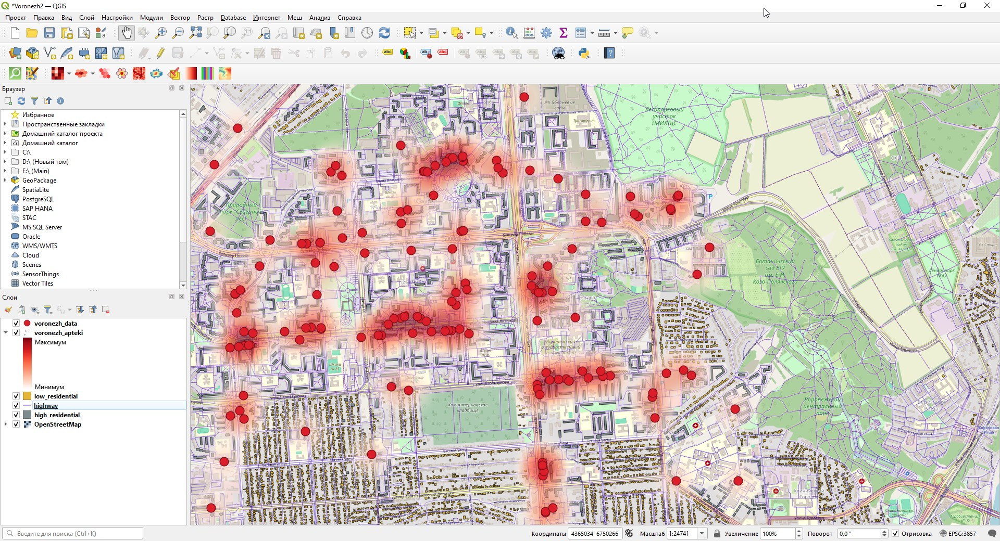

# Пространственный анализ доступности инфраструктурных объектов (на примере фармацевтического ритейла)

Пет-проект по геоаналитике и визуализации пространственных данных с использованием GIS-инструментов. 

## Идея и бизнес-задача
Цель проекта — оценить покрытие выбранной территории пунктами аптек и выявить потенциальные «слепые зоны» (территории с высоким спросом, но низкой плотностью инфраструктуры) для потенциального открытия новых точек или зоны покрытия доставки.

В качестве тестового полигона выбран жилой массив города Воронеж с конкретной застройкой (многоквартирные дома и частный сектор).

## Использованные инструменты и источники данных
* **ГИС-платформа:** QGIS
* **Базовый слой карт:** OpenStreetMap (OSM)
* **Источники данных:** Слой пространственных данных застройки и локаций коммерческих объектов (аптечных пунктов)
* **Методы анализа:**
  * Тепловая карта для визуализации доступности и плотности объектов
  * Разделение застройки по типам (`high_residential` — многоэтажная застройка с этажностью от 2 до 21; `low_residential` — частный сектор)
  * Слой дорожно-транспортной сети (`highway`)

## Результаты визуализации

### Что видно на карте:
1. **Распределение аптек (жирные красные точки):** Основная масса объектов сосредоточена вдоль главных транспортных артерий, крупных перекрестков и рядом с массивными жилыми комплексами с наибольшей плотностью населения.
2. **Тип застройки:** Серым цветом выделены зоны с многоквартирными домами (`high_residential`) — это локации с наибольшей плотностью населения и максимальным суточным пешеходным трафиком.
3. **Неравномерность покрытия аптечными пунктами:** Даже при высокой общей плотности аптек в многоквартирном секторе застройки, на карте отчетливо видны отдельные крупные жилые кварталы (серые блоки), где точки аптек отсутствуют или находятся только поблизости с главными дорогами района.

### Выводы для принятия решений:
* **Локализация спроса:** Выявлены конкретные зоны многоэтажек, где при высоком трафике и плотности населения отсутствует прямое покрытие аптеками в шаговой доступности.
* **Применение в E-commerce / Q-commerce:** Подход позволяет находить оптимальные точки для открытия новых ПВЗ, аптечных пунктов или локальных складов (Dark Store), а также точнее проектировать зоны курьерской доставки без перенасыщения логистики.
---
*Автор: [Денис Торгунов]*

